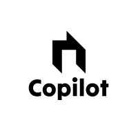

---

<!-- Improved compatibility of back to top link: See: https://github.com/othneildrew/Best-README-Template/pull/73 -->
<a name="readme-top"></a>
<!--
*** Thanks for checking out the Best-README-Template. If you have a suggestion
*** that would make this better, please fork the repo and create a pull request
*** or simply open an issue with the tag "enhancement".
*** Don't forget to give the project a star!
*** Thanks again! Now go create something AMAZING! :D
-->

<!-- PROJECT SHIELDS -->
<!--
*** I'm using markdown "reference style" links for readability.
*** Reference links are enclosed in brackets [ ] instead of parentheses ( ).
*** See the bottom of this document for the declaration of the reference variables
*** for contributors-url, forks-url, etc. This is an optional, concise syntax you may use.
*** https://www.markdownguide.org/basic-syntax/#reference-style-links
-->
[![Contributors][contributors-shield]][contributors-url]
[![Forks][forks-shield]][forks-url]
[![Stargazers][stars-shield]][stars-url]
[![Issues][issues-shield]][issues-url]
[![MIT License][license-shield]][license-url]
[![LinkedIn][linkedin-shield]][linkedin-url]

<!-- PROJECT LOGO -->
<br />
<div align="center">
    
  <h3 align="center">Line Bot Assistance</h3>

  <p align="center">
    บอทไลน์ผู้ช่วย
    <br />
    <br />
    <br />
  </p>
</div>

<!-- TABLE OF CONTENTS -->
<details>
  <summary>Table of Contents</summary>
  <ol>
    <li>
      <a href="#about-the-project">About The Project</a>
      <ul>
        <li><a href="#built-with">Built With</a></li>
      </ul>
    </li>
    <li>
      <a href="#getting-started">Getting Started</a>
      <ul>
        <li><a href="#prerequisites">Prerequisites</a></li>
        <li><a href="#installation">Installation</a></li>
      </ul>
    </li>
    <li><a href="#usage">Usage</a></li>
  </ol>
</details>

<!-- ABOUT THE PROJECT -->
## About The Project

  ในปัจจุบันมีการใช้งานของ AI มากขึ้น ที่ช่วยเหลือในชีวิตประจำวันในหลายๆด้านได้ไม่ว่าจะเป็นการสอบถามเรื่องที่ไม่รู้หรือเรียนรู้สิ่งใหม่ๆ ในหลายๆเรื่องต่างสามารถเรียนรู้ได้ด้วยตัวเองและสะดวกสบายมากขึ้นได้อย่างมากในชีวิตประจำวันของแต่ละคน

  กลุ่มของเราจึงตัดสินใจว่าจะทำเกี่ยวกับระบบของ AI ที่สามารถตอบกลับเราได้ผ่านแพลตฟอร์มของแอป Line เพราะเป็นแอปที่มีการใช้งานอย่างทั่วหลายและทั่วถึงทุกคน และให้ Raspberry Pi เป็นตัวเปิดเซิร์ฟเวอร์สำหรับการรับข้อมูลที่เราพิมพ์ไป และตอบกลับเราถึงที่สิ่งที่เราต้องการทราบ จึงเรียกว่า Line Bot Assistance

<p align="right">(<a href="#readme-top">back to top</a>)</p>

### Built With

* [Raspberry Pi](https://www.raspberrypi.org/)
* [@google/generative-ai](https://www.npmjs.com/package/@google/generative-ai)
* [@line/bot-sdk](https://www.npmjs.com/package/@line/bot-sdk)
* [axios](https://www.npmjs.com/package/axios)
* [chalk](https://www.npmjs.com/package/chalk)
* [dayjs](https://www.npmjs.com/package/dayjs)
* [express](https://www.npmjs.com/package/express)
* [request-promise](https://www.npmjs.com/package/request-promise)
* [ngrok](https://ngrok.com/)

<p align="right">(<a href="#readme-top">back to top</a>)</p>

<!-- GETTING STARTED -->
## Getting Started
### Prerequisites
* npm
  ```sh
  npm install npm@latest -g
  ```
* ngrok
  ```sh
  https://ngrok.com/docs/guides/device-gateway/raspberry-pi/
  ```
### Installation

1. Clone the repo
   ```sh
   git clone https://github.com/Risotto04/LineChatBot.git
   ```
2. ติดตั้ง NPM packages
   ```sh
   npm install
   ```
4. ป้อน API ของคุณใน `.env`
   ```env
     GEMINI_API_KEY = <Your Gemini API Key>
     CHANNEL_ACCESS_TOKEN = <Your Channel Access Token>
     CHANNEL_SECRET = <Your Channel Secret>
   ```

<p align="right">(<a href="#readme-top">back to top</a>)</p>

<!-- USAGE EXAMPLES -->
## Usage
<br />
<div align="center">
    
</div>

1. รันสคริปต์ index.js
   ```sh
     npm start
   ```
2. เรียกใช้ ngrok เพื่อทำ port forwarding สำหรับเปิด URL จาก localhost ของเราให้เป็น public
   ```sh
     ngrok http 3000 
   ```
3. คัดลอก URL Forwarding ไปใส่ช่อง Webhook URL ใน Line Developers Console


<p align="right">(<a href="#readme-top">back to top</a>)</p
